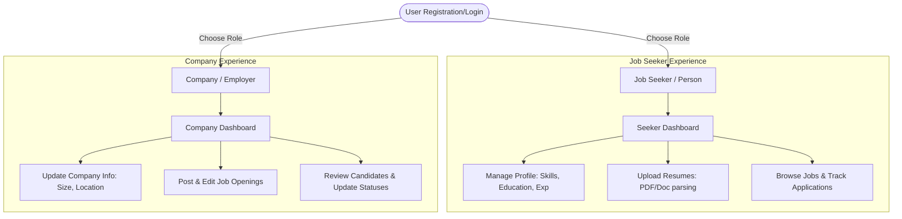
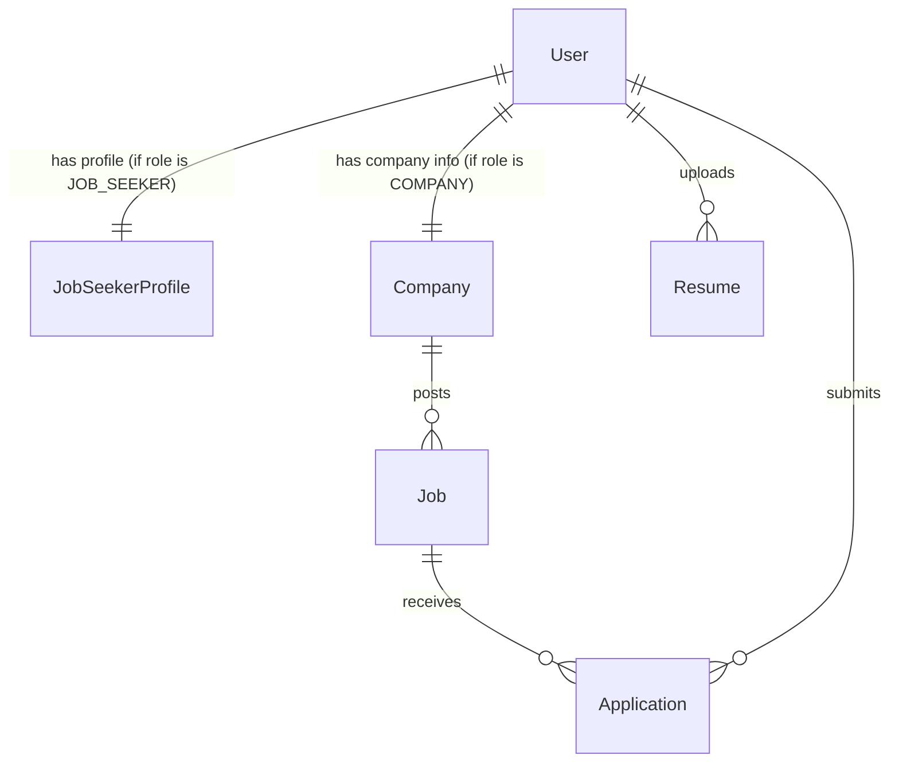

# TechStax Project Overview

TechStax is a streamlined, modern job board and applicant tracking application designed to bring job seekers and employers together with minimal noise and maximum clarity. 

This document provides a concise summary of the application's features, flows, backend stack, and database architecture.

---

## 🗺️ System Flow Overview

The following diagram illustrates the dual login paths and primary actions available to each user role:

---

## 🎨 Frontend & User Experience

### 1. Front Page (Landing Page)
* **Visuals & Animations**: The landing page includes responsive card sections, floating mockups with match indicators (e.g., matching percentages like *"86% profile match"*), and interactive hover elements. It features sleek background blur shapes (`blur-3xl`) that shift gracefully depending on screen size.
* **Tie-Up Highlights**: Displays key value propositions (*"Built for momentum"*) and shows curated job recommendations/opportunities from partnered companies.
* **CTAs**: Instant navigation routes to explore open roles or sign up.

### 2. Dual-Authentication (Person vs. Company)
The registration flow allows users to pick their path on the fly:
* **Job Seeker (Person)**: Registers with name and credentials to search for work.
* **Company (Employer)**: Registers with company name and personal details to hire teammates.
* **Authentication Security**: Uses email-password auth verified via **JSON Web Tokens (JWT)** and hashed passwords (**bcryptjs**).

---

## 🛠️ Internal Functionality

### 👤 If You Are an Employee (Job Seeker)
* **Profile Management**: Maintain skills, past experience, education, preferred work style (Remote, Hybrid, On-site), and expected salary ranges.
* **Resume Parsing**: Upload resumes (PDF, DOCX) which are parsed on the backend so the application can automatically fill out profile skills and details.
* **Application Tracker**: Save jobs for later, apply directly to postings, and track real-time statuses:
  $$\text{APPLIED} \longrightarrow \text{VIEWED} \longrightarrow \text{SHORTLISTED} \longrightarrow \text{INTERVIEW}$$

### 🏢 If You Are a Company (Employer)
* **Company Profile**: Customize industry details, team size, location, logo, and website link.
* **Job Publishing**: Create, edit, and publish job listings with description, skills required, work mode, and salary.
* **Candidate Review**: Browse profiles of applicants, download their parsed resumes, and update application statuses (e.g., transition candidate to "Viewed" or "Interview" phase).

---

## ⚙️ Backend & Database Architecture

### 🚀 Backend Stack (Express.js & TypeScript)
The backend is an API server built on **Node.js** and **Express.js (TypeScript)**. 

* **Validation**: Request bodies are validated at the middleware layer using **Zod** schemas.
* **Security & Reliability**: Configured with `helmet`, `cors`, and `express-rate-limit` to handle requests securely.
* **Document Parsing**: Utilizes `pdf-parse` (for PDF files) and `mammoth` (for DOCX files) inside file-handling controllers to parse resume text dynamically.
* **File Uploads**: Managed via `multer` (temporary uploads directory).

### 💾 Database Setup (MongoDB & Mongoose)
The persistent data store is **MongoDB**, modeled using **Mongoose ODM**. 

Here is the database entity-relationship model:

#### Key Schema Descriptions:
1. **User Schema**: Stores credentials (email, hashed password), login providers (Google OAuth metadata), and the user `role` (`JOB_SEEKER`, `COMPANY`, `ADMIN`).
2. **Company Schema**: Stores the business-specific info, connected to the owner's `userId`.
3. **JobSeekerProfile Schema**: Holds the parsed resume text, education, experience fields, and preferences.
4. **Job Schema**: Details of the position, referenced to the posting `companyId`.
5. **Application Schema**: Connects a `jobId` and a `seekerId` (User) along with the current review status and application timestamp.
